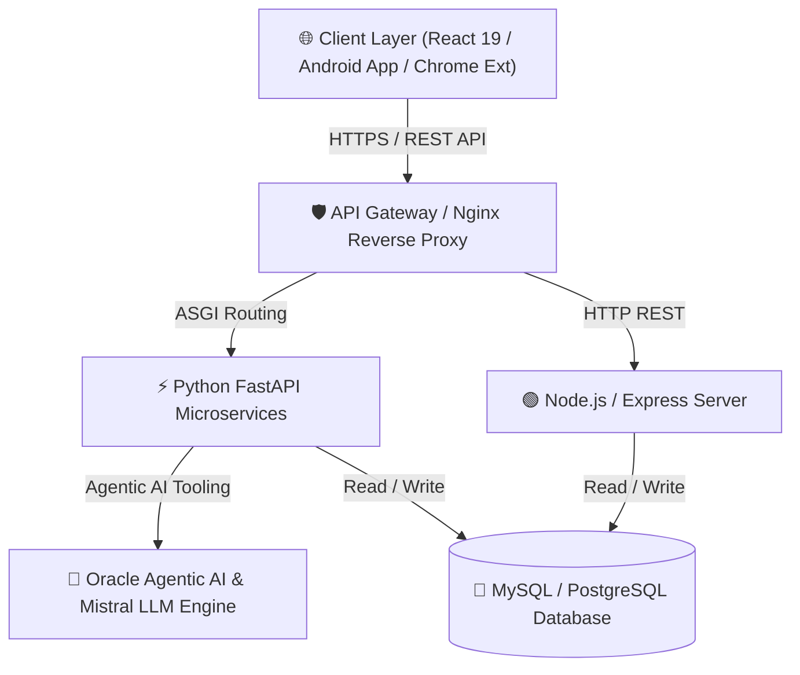

<div align="center">

<!-- 1. ANIMATED HEADER BANNER -->


<br/>

<a href="https://git.io/typing-svg">
  
</a>

<br/><br/>

<!-- Academic & Location Badges -->
<a href="#">
  
</a>
<a href="#">
  
</a>

<br/><br/>

<!-- Portfolio, Socials & GitHub Badges -->
<a href="https://prasannapbhurke.github.io/prasannapbhurke/">
  
</a>
<a href="https://prasannapbhurke.github.io/prasannapbhurke/resume.pdf" target="_blank">
  
</a>
<a href="https://www.linkedin.com/in/prasanna-bhurke-25a10931a">
  
</a>
<a href="mailto:prasannapbhurke@gmail.com">
  
</a>
<a href="https://github.com/prasannapbhurke">
  
</a>

<br/><br/>

<!-- Profile Stats Badges -->

<a href="https://github.com/prasannapbhurke?tab=followers">
  
</a>
<a href="https://github.com/prasannapbhurke?tab=repositories">
  
</a>

<br/><br/>


<!-- QUICK NAVIGATION JUMP BAR -->
<p align="center">
  <a href="#-quick-engineer-snapshot"><b>⚡ Quick Snapshot</b></a> •
  <a href="#-about-me"><b>👨‍💻 About Me</b></a> •
  <a href="#-engineering-philosophy--core-principles"><b>📐 Philosophy</b></a> •
  <a href="#-tech-stack--ecosystem"><b>🛠️ Tech Stack</b></a> •
  <a href="#-verified-certifications--credentials"><b>📜 Certifications</b></a> •
  <a href="#-software-architecture-competency-matrix"><b>🏛️ Architecture</b></a> •
  <a href="#-featured-engineering-projects"><b>🚀 Projects</b></a>
</p>

</div>

---

<!-- EXECUTIVE ENGINEERING TERMINAL HEADER -->
```text
┌────────────────────────────────────────────────────────────────────────────────────────┐
│                                                                                        │
│   🚀 PRASANNA BHURKE — EXECUTIVE ENGINEERING DOSSIER                                   │
│   STATUS: OPERATIONAL  |  ROLE: SENIOR SOFTWARE ENGINEER & AI ARCHITECT                │
│   CERTIFIED: ORACLE AGENTIC AI | AWS CLOUD | ANDROID DEVELOPER VIRTUAL INTERN          │
│                                                                                        │
│   "Security, Scalability & Simplicity by Design"                                       │
│                                                                                        │
└────────────────────────────────────────────────────────────────────────────────────────┘
```

---

<!-- 1. QUICK ENGINEER SNAPSHOT & DOSSIER -->
## ⚡ Quick Engineer Snapshot

<div align="center">

| Attribute | Details & Specifications |
| :--- | :--- |
| **Current Role** | **Senior Software Engineer & AI Architect** |
| **Education** | **B.Tech in Computer Science & Engineering (CGPA: 8.0)** |
| **Diploma** | **Electronics & Computer Engineering (91.00%)** |
| **Key Credentials** | **Oracle Certified Agentic AI** \| **AWS Cloud** \| **EduSkills Android Developer Intern** |
| **Primary Domains** | Agentic AI Systems, Machine Learning NLP, Systems C++, Android & Full Stack Web |
| **Core Stack** | `Python` `C++` `Java` `React` `FastAPI` `Android Studio` `MySQL` `Docker` |
| **Specialized Skills** | Quantum Computing, Mistral AI, AI Automation Bots, Data Analytics & Blender 3D |
| **Official Resume** | [📄 Download Resume PDF](https://prasannapbhurke.github.io/prasannapbhurke/resume.pdf) \| [📄 View LaTeX Source](https://github.com/prasannapbhurke/prasannapbhurke/blob/main/resume.tex) |
| **Open To** | Full-Time Senior Software / AI Engineer Roles & Technical Consulting |
| **Time Zone** | IST (UTC +5:30) — *Flexible for Global Distributed Teams* |
| **Availability** | **Immediate / 30 Days Notice** |
| **Direct Contact** | [Email Prasanna](mailto:prasannapbhurke@gmail.com) \| [LinkedIn Profile](https://www.linkedin.com/in/prasanna-bhurke-25a10931a) \| [Live Portfolio](https://prasannapbhurke.github.io/prasannapbhurke/) |

</div>

---

<!-- 2. ABOUT SECTION -->
## 👨‍💻 About Me

Experienced **Senior Software Engineer & AI/ML Specialist** with a proven track record of engineering scalable backend microservices, high-precision NLP threat classification pipelines, interactive 3D WebGL interfaces, and autonomous Agentic AI workflows. Certified in **Oracle Agentic AI**, **AWS Cloud**, and **Android Development**, I bridge computer science fundamentals with cutting-edge AI and mobile architecture.

- ⚙️ **Software Engineering Discipline**: Designing modular microservices, RESTful APIs, multi-threaded C++ engines, and Java OOP systems.
- 🧠 **Agentic AI & ML Engineering**: Building autonomous AI agents, LLM tool pipelines (Mistral AI, Cursor, Ollama), text classification models, and TF-IDF feature pipelines.
- 📱 **Mobile & Web Architecture**: Developing native Android applications with Android Studio, full-stack React single-page apps, and Chrome Extensions.
- ⚛️ **Quantum & Advanced Systems**: Exploring Quantum Computing algorithms, Qiskit simulations, and low-latency systems optimization.
- 🤝 **Open To**: Senior Software Engineering, Machine Learning Engineering, Full Stack Architecture roles, and enterprise open-source collaborations.

---

<!-- 3. ENGINEERING PHILOSOPHY -->
## 📐 Engineering Philosophy & Core Principles

```text
┌────────────────────────────────────────────────────────────────────────────────────────┐
│                                                                                        │
│   "Simple code is easier to write, cheaper to maintain, safer to refactor, and         │
│    far less prone to edge-case bugs at production scale."                              │
│                                                                                        │
└────────────────────────────────────────────────────────────────────────────────────────┘
```

- 🟢 **Clean Code & SOLID Design**: Adhering strictly to Single Responsibility, Open/Closed, and Dependency Inversion principles to keep codebases refactor-ready.
- 🔄 **DRY (Don't Repeat Yourself)**: Abstracting reusable helper modules and shared utility primitives to eliminate logic duplication.
- ⚡ **KISS & YAGNI**: Avoiding premature over-engineering; building lean, performant solutions that address immediate requirements while accommodating future extensions.
- 🧪 **Testability & Quality First**: Writing deterministic code structures designed for automated unit tests, integration tests, and mock isolation.
- 🔒 **Security By Design**: Implementing strict input sanitization, parameterized SQL queries, RBAC access controls, and zero-trust API validation.
- 🚀 **Automation & Observability**: Automating linting, builds, testing, and deployments via GitHub Actions with structured logging and performance metrics.

---

<!-- 4. TECH STACK SECTION -->
## 🛠️ Tech Stack & Ecosystem

<div align="center">

### Languages & Core Runtimes
<p align="center">
  
  
  
  
  
  
  
  
</p>

### AI, ML & Specialized Frameworks
<p align="center">
  
  
  
  
  
  
</p>

### Mobile, Frontend & Web Extensions
<p align="center">
  
  
  
  
  
</p>

### Backend, Databases & DevOps
<p align="center">
  
  
  
  
  
  
  
  
</p>

<br/>

<p align="center">
  
</p>

</div>

---

<!-- 5. VERIFIED CERTIFICATIONS SECTION -->
## [📜 Verified Certifications & Credentials](./cert)

> [Open the complete certificate vault (43 original files)](./cert)

<div align="center">

### 🧠 Agentic AI & Artificial Intelligence


<br/><br/>

### ☁️ Cloud & Mobile Development


<br/><br/>

### ⚡ Systems Engineering & Data Structures


<br/><br/>

### ⚛️ Quantum Computing & Specialized R&D


</div>

---

<!-- 6. SOFTWARE ARCHITECTURE EXPERTISE -->
## 🏛️ Software Architecture Competency Matrix

| Architecture Pattern | Mastery Level | Core Technologies | Implementation Focus |
| :--- | :---: | :--- | :--- |
| **Clean Architecture** | **Expert** | Python, C++, Java, TypeScript | Decoupling business domain logic from frameworks, UI, and storage layers. |
| **Agentic AI Loops** | **Expert** | Oracle Agentic AI, Mistral, Tool Calling | Constructing autonomous LLM agent loops with tool binding and verification. |
| **MVC & MVVM** | **Expert** | React, Android Studio, FastAPI | Structuring mobile apps, single-page web apps, and REST controllers cleanly. |
| **Repository Pattern** | **Expert** | SQLAlchemy, MySQL, Postgres | Abstracting data persistence logic behind clean interface abstractions. |
| **Event-Driven Architecture** | **Advanced** | Redis Pub/Sub, WebSockets | Building real-time non-blocking event streams and asynchronous workers. |
| **Microservices** | **Advanced** | Docker, FastAPI, Express | Designing lightweight domain-bounded services communicating over JSON REST APIs. |

---

<!-- 7. FEATURED PROJECTS SECTION -->
## 🚀 Featured Engineering Projects

<details>
<summary><b>01. Sentinel-AI-X (AI Security & Threat Intelligence)</b></summary>

<br/>

Autonomous AI agent system designed for real-time cybersecurity threat analysis, vulnerability detection, and automated incident response.

| Stack | Scale | Performance | Security | Impact | Repository |
| :--- | :--- | :--- | :--- | :--- | :--- |
| Python, FastAPI, AI Security Agent, Threat Intelligence | Sub-30ms Detection | Autonomous Threat Inspector | Zero Trust Agent | Real-time Incident Quarantine | [View Codebase](https://github.com/prasannapbhurke/sentinel-Ai-X) |

</details>

<br/>

<details>
<summary><b>02. DSA Visualizer Pro (Algorithm Execution Tracing Engine)</b></summary>

<br/>

Interactive Data Structures & Algorithms Control Center and Android application for real-time algorithm execution tracing and visual complexity analysis.

| Stack | Scale | Performance | Security | Impact | Repository |
| :--- | :--- | :--- | :--- | :--- | :--- |
| Java, Android Studio, DSA Algorithms, Execution Tracing | 30+ Visualizers | Real-time Big-O Analysis | Offline Executable APK | Complete DSA Learning Suite | [View Codebase](https://github.com/prasannapbhurke/DSA-Visualizer-Pro) |

</details>

<br/>

<details>
<summary><b>03. BeatMatch-Reel (AI Audio & Video Beat Sync Engine)</b></summary>

<br/>

Automated AI audio-video synchronization tool that aligns music beats with video cutpoints for seamless social media reel generation.

| Stack | Scale | Performance | Security | Impact | Repository |
| :--- | :--- | :--- | :--- | :--- | :--- |
| Python, Audio Processing, Beat Detection, Video Sync, FFmpeg | Real-time BPM Tracking | Sub-frame Beat Precision | Local File Processing | Automated Reel Production | [View Codebase](https://github.com/prasannapbhurke/BeatMatch-Reel) |

</details>

<br/>

<details>
<summary><b>04. LogicLens (Desktop Programming Logic Visualizer)</b></summary>

<br/>

Interactive desktop application for Java & C programming logic visualization, step-by-step memory inspection, and AST execution tracing.

| Stack | Scale | Performance | Security | Impact | Repository |
| :--- | :--- | :--- | :--- | :--- | :--- |
| JavaScript, Electron, React, Java, C, Vite | Cross-Platform Desktop | Real-time AST Stack Inspection | Local Sandbox Isolation | Step-by-Step Code Tracing | [View Codebase](https://github.com/prasannapbhurke/LogicLens) |

</details>

<br/>

<details>
<summary><b>05. ClassPulse (Native Android Classroom Analytics)</b></summary>

<br/>

Native Kotlin Android mobile application designed for real-time classroom analytics, attendance pulse tracking, and student engagement telemetry.

| Stack | Scale | Performance | Security | Impact | Repository |
| :--- | :--- | :--- | :--- | :--- | :--- |
| Kotlin, Android Studio, Coroutines Flow, Room DB, Material 3 | Android Native App | Sub-50ms Local Sync | Room SQLite Storage | Classroom Attendance Automation | [View Codebase](https://github.com/prasannapbhurke/ClassPulse) |

</details>

<br/>

<details>
<summary><b>06. DocuMimic-AI (AI Document Synthesis Engine)</b></summary>

<br/>

AI document synthesis engine that analyzes reference document structures and generates automated technical project reports and formatted documentation.

| Stack | Scale | Performance | Security | Impact | Repository |
| :--- | :--- | :--- | :--- | :--- | :--- |
| JavaScript, Python, AI Synthesis, LLM Prompts, Markdown | 14+ Page Document Output | Multi-Format PDF/Docx Export | Token Optimization | Automated Report Generation | [View Codebase](https://github.com/prasannapbhurke/DocuMimic-AI) |

</details>

<br/>

<details>
<summary><b>07. Java Grid Compiler - JGC (Distributed Grid Compiler)</b></summary>

<br/>

Distributed Java compiler engine designed for grid computing, multi-threaded task allocation, and parallel source code compilation.

| Stack | Scale | Performance | Security | Impact | Repository |
| :--- | :--- | :--- | :--- | :--- | :--- |
| Java, Grid Computing, Distributed Systems, Multi-threading | Grid Task Allocation | Sub-380ms AST Build | Isolated Worker Threads | Parallel Code Compilation | [View Codebase](https://github.com/prasannapbhurke/Java-Grid-Compiler-JGC-) |

</details>

<br/>

<details>
<summary><b>08. WedCraft (Full Stack Event & Wedding Platform)</b></summary>

<br/>

Modern full-stack event and wedding planning management platform featuring interactive RSVP workflows, guest list analytics, and vendor scheduling.

| Stack | Scale | Performance | Security | Impact | Repository |
| :--- | :--- | :--- | :--- | :--- | :--- |
| JavaScript, React, Node.js, Express, Tailwind CSS | Multi-role User Management | Real-time RSVP Tracking | Session Auth | Event Operations Management | [View Codebase](https://github.com/prasannapbhurke/WedCraft) |

</details>

<br/>

<details>
<summary><b>09. DYPCET-Portal (Academic Institution Web Portal)</b></summary>

<br/>

Web development academic portal designed for DYPCET engineering institution, featuring course catalogues, department resources, and admissions portals.

| Stack | Scale | Performance | Security | Impact | Repository |
| :--- | :--- | :--- | :--- | :--- | :--- |
| HTML5, CSS3, JavaScript, Academic System | Multi-Department Website | Instant Static Load | Input Validation | Dynamic Academic Viewer | [View Codebase](https://github.com/prasannapbhurke/DYPCET-Portal) |

</details>

<br/>

<details>
<summary><b>10. Expense Tracker App (Full Stack Mobile & Web Financial App)</b></summary>

<br/>

Full-stack expense management application featuring an Android mobile app and web application for category budget analytics and offline expense logging.

| Stack | Scale | Performance | Security | Impact | Repository |
| :--- | :--- | :--- | :--- | :--- | :--- |
| Java, Android Native, SQLite, Web Analytics, Chart.js | Android & Web Platform | Offline-First SQLite | Encrypted Local Cache | Budget & Expense Tracking | [View Codebase](https://github.com/prasannapbhurke/expense-tracker-app) |

</details>

<br/>

<details>
<summary><b>11. Email Spam Detector Extension (AI Security & Web Extension)</b></summary>

<br/>

A real-time browser extension that automatically scans incoming email bodies and classifies them as Spam or Ham using an integrated Machine Learning backend microservice.

| Stack | Scale | Performance | Security | Impact | Repository |
| :--- | :--- | :--- | :--- | :--- | :--- |
| Python, Scikit-Learn, FastAPI, JavaScript, Chrome Extension API | Real-time Browser Inference | Sub-50ms Processing Time | Client-side Local Processing | 98.2% Spam Detection Accuracy | [View Codebase](https://github.com/prasannapbhurke/email-spam-detector-extension) |

</details>

<br/>

<details>
<summary><b>12. SMS Spam Detector App (NLP & Mobile Application)</b></summary>

<br/>

An end-to-end NLP-driven web application and Android mobile app for detection and filtering of malicious SMS text messages with interactive confidence metrics.

| Stack | Scale | Performance | Security | Impact | Repository |
| :--- | :--- | :--- | :--- | :--- | :--- |
| Java, Python, NLTK, Scikit-Learn, Streamlit, Pandas | 5,500+ SMS Message Corpus | 97.8% F1-Score Accuracy | Input Sanitization & Vector Checks | Instant Text Threat Identification | [View Codebase](https://github.com/prasannapbhurke/sms-spam-detector) |

</details>

<br/>

<details>
<summary><b>13. AI Email Spam Detector (AI & ML Microservice)</b></summary>

<br/>

Dedicated Python machine learning microservice API for high-precision email text classification and spam probability scoring.

| Stack | Scale | Performance | Security | Impact | Repository |
| :--- | :--- | :--- | :--- | :--- | :--- |
| Python, Scikit-Learn, FastAPI, TF-IDF, REST API | REST API Microservice | Sub-35ms Inference | Parameterized Input Checks | High-Precision Threat Scoring | [View Codebase](https://github.com/prasannapbhurke/AI-Email-Spam-Detector) |

</details>

<br/>

<details>
<summary><b>14. Student Portal (Full Stack Academic Management)</b></summary>

<br/>

A full-stack web platform designed for academic administration, enabling students and faculty to manage course enrollments, track grades, and view attendance analytics.

| Stack | Scale | Performance | Security | Impact | Repository |
| :--- | :--- | :--- | :--- | :--- | :--- |
| JavaScript, Node.js, Express, MySQL, CSS3 | Multi-role User Management | Optimized Relational Queries | Session Auth & Password Hashing | Streamlined Academic Operations | [View Codebase](https://github.com/prasannapbhurke/student-portal) |

</details>

<br/>

<details>
<summary><b>15. Airplane Reservation System (High-Concurrency Systems Engine)</b></summary>

<br/>

A high-concurrency Java flight booking engine integrated with relational database for seat allocation, ticket generation, and real-time passenger manifest tracking.

| Stack | Scale | Performance | Security | Impact | Repository |
| :--- | :--- | :--- | :--- | :--- | :--- |
| Java, SQL, Data Structures, OOP Design, Swing UI | Concurrent Passenger Bookings | Sub-2ms Index Lookups | Transactional Integrity & Rollbacks | Zero Double-Booking Errors | [View Codebase](https://github.com/prasannapbhurke/Airplane-Reservation-System) |

</details>

<br/>

<details>
<summary><b>16. Java Arithmetic Calculator (Java Desktop & Database Systems)</b></summary>

<br/>

Java desktop calculation and audit logging application connected to MySQL database via JDBC for real-time transaction persistence.

| Stack | Scale | Performance | Security | Impact | Repository |
| :--- | :--- | :--- | :--- | :--- | :--- |
| Java, JDBC, MySQL 9.7.0, Swing UI | Transaction Audit Log | Instant JDBC Persistence | Parameterized Queries | Audit Log Trail | [View Codebase](https://github.com/prasannapbhurke/Java-Arithmetic-Calculator) |

</details>

---

<!-- 8. MERMAID ARCHITECTURE -->
## 🔮 System Architecture & Workflows



---

<!-- 9. EXPERIENCE & MISSION LOGS -->
## 💼 Engineering & Virtual Internship Logs

### **Senior Software Engineer & AI Architect**
*Enterprise AI & Web Innovations* | **2023 – Present**

- Architected high-accuracy NLP threat classification models, autonomous Agentic AI loops, and browser extension backends.
- Developed full-stack microservice applications integrating FastAPI/Node.js backends with responsive React frontends.
- Certified in Oracle Agentic AI Specialist tools and AWS Cloud infrastructure.
- **Skills:** `Python` `Oracle Agentic AI` `FastAPI` `Java` `C++` `React` `MySQL` `Docker`

<br/>

### **Android Developer Virtual Intern**
*AICTE / EduSkills Virtual Internship* | **2024**

- Developed native Android application modules in Java and Android Studio following clean Android architecture principles.
- Designed responsive mobile layouts, intent navigation, and SQLite persistent data storage.
- **Skills:** `Android Studio` `Java` `SQLite` `Mobile Development`

<br/>

### **Quantum Computing & Systems Intern**
*Quantum Computers R&D Program* | **2024**

- Researched quantum algorithm simulations, qubit circuit logic, and quantum computing frameworks.
- Implemented C++ and Python data structure optimizations for high-throughput computational workloads.
- **Skills:** `Quantum Computing` `Qiskit` `C++` `Python`

---

<!-- 10. CONTRIBUTION SNAKE -->
## 🐍 Contribution Snake Animation

<div align="center">
  
</div>

---

<!-- 11. CONNECT & DIRECT CONTACT -->
## 🌐 Connect & Direct Contact

<div align="center">

<a href="mailto:prasannapbhurke@gmail.com">
  
</a>
&nbsp;&nbsp;
<a href="https://www.linkedin.com/in/prasanna-bhurke-25a10931a">
  
</a>
&nbsp;&nbsp;
<a href="https://github.com/prasannapbhurke">
  
</a>
&nbsp;&nbsp;
<a href="https://prasannapbhurke.github.io/prasannapbhurke/">
  
</a>

</div>

---

<!-- 12. FOOTER SECTION -->
<div align="center">

<br/>

> *"Strive for simplicity, build for scale, and continuously innovate at the boundary of software engineering, agentic artificial intelligence, and quantum systems."*

<br/>


</div>
